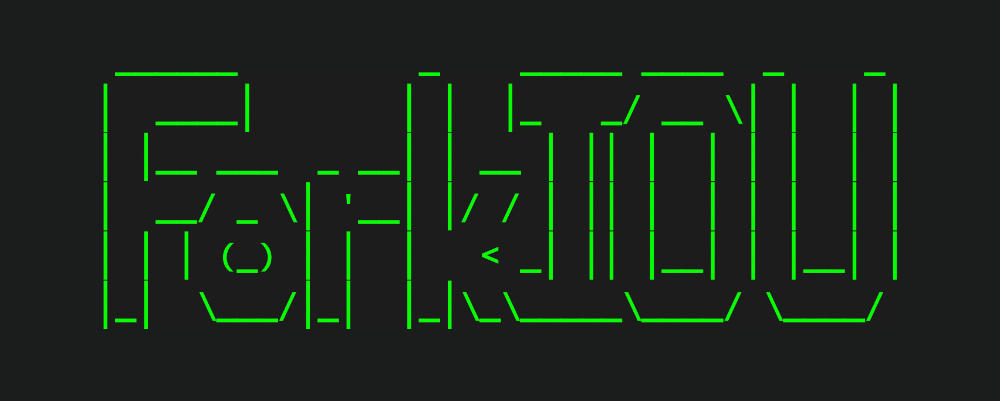

# ForkIOU


https://forkiou.com/

ForkIOU is a trustless ether/ETHW splitting mechanism that provides exposure to ETHW on mainnet. ETHW-IOUs exist as an ERC20 token on mainnet and can be issued pre-merge by depositing ether into the ForkIOU contract. Post-merge, ETHW-IOUs are redeemable from the contract on the ethereumPoW fork, and ether are redeemable from the contract on mainnet.  

* Ether are locked in the ForkIOU contract on mainnet until after the merge (when `block.difficulty >= 2**64`).
* ETHW-IOUs are able to be transferred freely on-chain.
* ETHW-IOUs can be redeemed for ETHW on the ethereumPoW chain when it is online.

## Install & Test

ForkIOU works best with node 16+. Compile and run tests by cloning the repo and executing `hardhat test` via `npm` or `yarn`:
```bash
nvm use 16.10
yarn install 
yarn hardhat test
```


## FAQ

### Why would I use this?
Without ForkIOU, there's no way to gain exposure to ETHW pre-merge on mainnet. 

### Are there any risks?
Aside from smart contract risk (see verified code on etherscan) ETHW-IOUs become worthless on mainnet post-merge. LP positions with ETHW-IOUS are likely to be evaporated soon after the merge. If you're an LP, you must remove liquidity before the merge. We make no guarantees regarding the decisions or actions of the ethereumPoW devs. 

### Can I split my ETHW from my ether with this tool?
Yes, that's the main reason to use ForkIOU. ETHW-IOUs are split from your ether on mainnet giving you the ability to access the value of your ETHW pre-merge. If you can find a way to swap your ETHW-IOUs on mainnet then you never have to interact with the ethereumPoW chain. If you decide to keep your ETHW-IOUs then you can redeem them for ETHW on the ethereumPoW fork.

### How do I get my ether back on mainnet?
You can simply withdraw your ether after the merge.

### Are there fees?
There is no fee for depositing or withdrawing ether on mainnet. There is a 5% fee for withdrawing ETHW on the ethereumPoW chain. 

## License
_SPDX-License-Identifier:_ [WTFPL](https://spdx.org/licenses/WTFPL.html)

